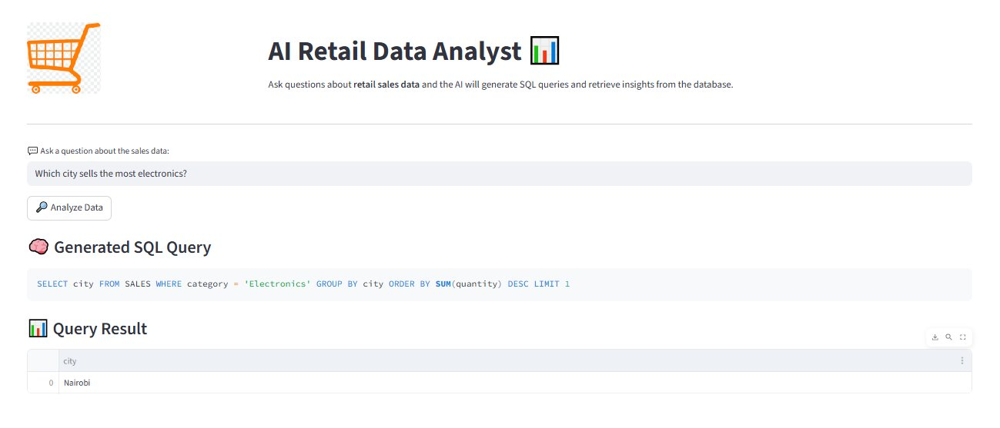

# 📊 AI Retail Data Analyst

> Ask questions in plain English — get instant SQL-powered insights from your retail sales data.

An **AI-powered data analytics assistant** built with Python and Streamlit that converts natural language questions into SQL queries using **Google's Gemini LLM**, then executes them against a local SQLite database and displays the results in an interactive dashboard.

---

## Screenshot



*The app answering "Which city sells the most electronics?" — Gemini generates the SQL query and returns the result instantly.*

---

## Demo

**User asks:**
```
Which city sells the most electronics?
```

**Gemini generates:**
```sql
SELECT city FROM SALES WHERE category = 'Electronics'
GROUP BY city ORDER BY SUM(quantity) DESC LIMIT 1
```

**Result:**
```
Nairobi
```

---

## Features

- 🤖 **Natural Language → SQL** via Google Gemini 2.5 Flash
- 📊 **Interactive Streamlit dashboard** with a clean, wide layout
- 🗃️ **SQLite database** — lightweight, no setup required
- 🧠 **Prompt engineering** for accurate, structured SQL output
- 📦 **Pandas integration** — results returned as DataFrames
- 🔐 **Secure API key management** via `.env`

---

## Tech Stack

| Technology | Role |
|---|---|
| Python | Core language |
| Streamlit | Web interface |
| SQLite | Local database |
| Google Gemini API (`gemini-2.5-flash`) | NL → SQL generation |
| Pandas | Query result handling |
| python-dotenv | API key management |

---

## Project Structure

```
ai-retail-data-analyst/
│
├── app.py                # Streamlit app — UI, Gemini call, query execution
├── create_db.py          # Creates and seeds the SQLite database
├── prompts.py            # Gemini prompt instructions
├── requirements.txt      # Dependencies
├── .env                  # API key (not committed to Git)
│
├── data/
│   └── sales.db          # SQLite database
│
├── images/
│   └── logo.png          # App logo
│
└── README.md
```

---

## Database Schema

**Table: `SALES`**

| Column | Type | Description |
|---|---|---|
| `id` | INTEGER | Auto-incrementing primary key |
| `branch` | TEXT | Store branch name |
| `city` | TEXT | City where the sale occurred |
| `product` | TEXT | Product name |
| `category` | TEXT | Product category |
| `quantity` | INT | Units sold |
| `price` | REAL | Price per unit (KES) |
| `revenue` | REAL | Total revenue from sale (KES) |
| `sale_date` | TEXT | Date of transaction (YYYY-MM-DD) |

**Sample Data:**

| branch | city | product | category | quantity | revenue |
|---|---|---|---|---|---|
| Westlands | Nairobi | TV | Electronics | 2 | 120,000 |
| Nyali | Mombasa | Fridge | Appliances | 1 | 80,000 |
| Kisumu Central | Kisumu | Phone | Electronics | 5 | 100,000 |
| CBD | Nairobi | Laptop | Electronics | 3 | 270,000 |
| Nyali | Mombasa | Microwave | Appliances | 2 | 30,000 |

---

## Getting Started

### Prerequisites

- Python 3.8+
- A Google Gemini API key → [Get one here](https://ai.google.dev/)

---

### 1. Clone the Repository

```bash
git clone https://github.com/yourusername/ai-retail-data-analyst.git
cd ai-retail-data-analyst
```

### 2. Create & Activate a Virtual Environment

```bash
python -m venv venv
```

**Windows:**
```bash
venv\Scripts\activate
```

**Linux / Mac:**
```bash
source venv/bin/activate
```

### 3. Install Dependencies

```bash
pip install -r requirements.txt
```

### 4. Configure Your API Key

Create a `.env` file in the project root:

```
GOOGLE_API_KEY=your_api_key_here
```

> ⚠️ Never commit your `.env` file. Add it to `.gitignore`.

### 5. Seed the Database

```bash
python create_db.py
```

This creates `data/sales.db` and populates it with sample retail records.

### 6. Launch the App

```bash
streamlit run app.py
```

Open your browser at `http://localhost:8501`.

---

## How It Works

```
User types a question
        ↓
Question sent to Gemini 2.5 Flash with a custom prompt
        ↓
Gemini returns a SQL query
        ↓
Query executed on sales.db via SQLite
        ↓
Result loaded into a Pandas DataFrame
        ↓
Displayed in the Streamlit dashboard
```

---

## Example Questions

```
Show all sales in Nairobi
```
```
Which product generated the highest revenue?
```
```
What is the total revenue across all cities?
```
```
Which city sells the most electronics?
```
```
How many units of laptops were sold?
```

---

## Requirements

```
streamlit
google-generativeai
python-dotenv
pandas
```

---

## Future Improvements

- [ ] Multi-table database support
- [ ] Data visualisation charts (bar, line, pie)
- [ ] Upload and query custom CSV datasets
- [ ] SQL query validation and injection protection
- [ ] PostgreSQL / cloud database integration
- [ ] Conversational chat interface with query history

---

## Author

**Alan Muchiri**
Mechatronics Engineer transitioning into Data Engineering and AI Systems.

[](https://github.com/Alanmuchiri)

---

## License

This project is licensed under the [MIT License](LICENSE).
